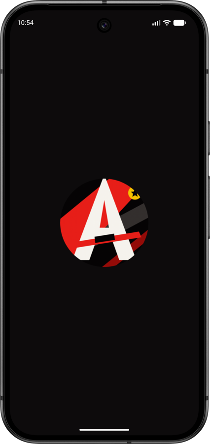
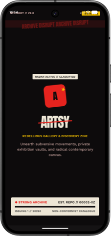
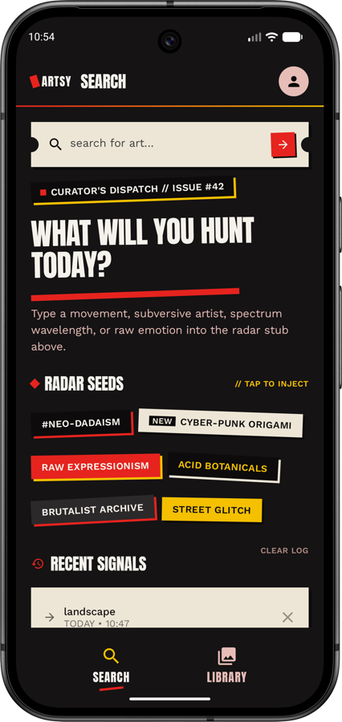
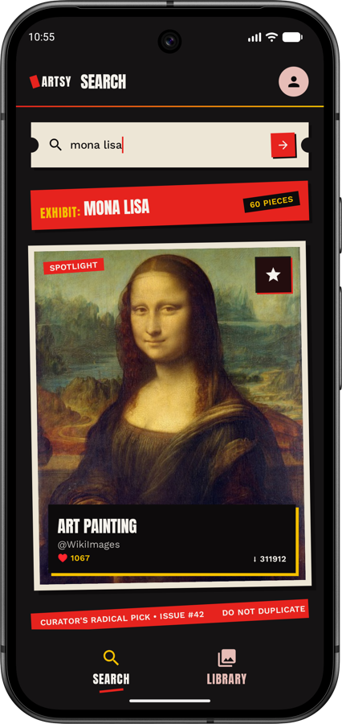
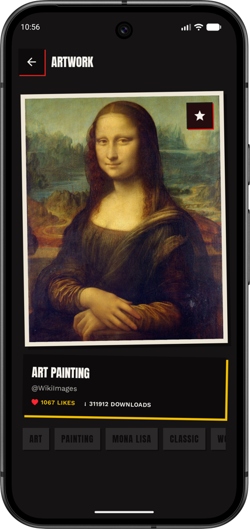
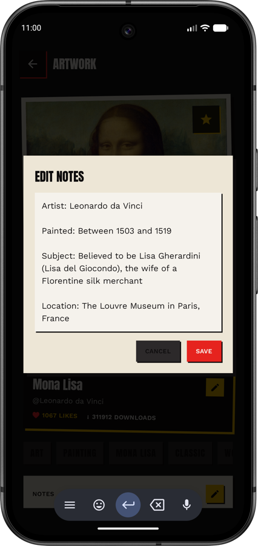
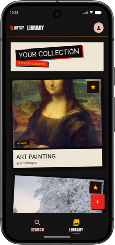

# Artsy

An Android app for discovering artwork from [Pixabay](https://pixabay.com/), saving pieces to a personal library, annotating them with notes, and uploading your own images alongside curated art.

## Features

- **Search** — search Pixabay's art catalog with debounced search-as-you-type, recent search history, and infinite scroll (Paging 3).
- **Library** — save artwork locally (Room) for offline access; the library screen degrades gracefully to cached data when the network is unavailable.
- **Artwork details** — view full artwork details, edit a title, and attach personal notes to saved pieces. Pieces with notes show a badge in the library grid.
- **Device uploads** — add your own images from the device alongside saved Pixabay art.

## Screenshots

| Splash | Intro | Search |
|---|---|---|
|  |  |  |

| Search results | Artwork detail | Edit notes |
|---|---|---|
|  |  |  |

| Library |
|---|
|  |

## Architecture

Clean Architecture with MVVM on top:

```
presentation  →  domain  ←  data
```

- **`domain/`** — pure Kotlin, no Android framework dependencies. Contains models, repository interfaces, and use cases. Each public use case is a single-purpose class (e.g. `SearchArtUseCase`, `ToggleSaveArtUseCase`, `UpdateArtNotesUseCase`).
- **`data/`** — implements the domain repository interfaces. Retrofit + OkHttp talk to the Pixabay API (`data/remote`), Room provides local persistence and acts as the offline cache for saved art (`data/local`). Paging 3's `PagingSource` implementations live in `data/remote/paging`.
- **`presentation/`** — Jetpack Compose screens organized by feature (`presentation/screens/search`, `.../library`, `.../artworkdetail`, `.../splash`). Each screen has a `ViewModel` that exposes a single sealed `UiState` via `StateFlow`, with no business logic — everything is delegated to use cases in the domain layer.

Navigation is single-activity, using Navigation Compose with routes defined as a sealed class (`presentation/navigation/Screen.kt`).

## Tech stack

| Concern | Library |
|---|---|
| UI | Jetpack Compose (Material 3) |
| DI | Hilt |
| Networking | Retrofit + OkHttp + Moshi |
| Local storage | Room |
| Pagination | Paging 3 (network + Room) |
| Image loading | Coil |
| Async | Kotlin Coroutines + Flow |
| Navigation | Navigation Compose |

Key versions: Kotlin 2.2.10, AGP 9.2.1, Room 2.8.2, Paging 3.3.6, Retrofit 3.0.0. See `gradle/libs.versions.toml` for the full catalog.

## Getting started

### Prerequisites

- Android Studio (latest stable)
- JDK 11+
- A free [Pixabay API key](https://pixabay.com/api/docs/)

### Setup

1. Clone the repo.
2. Add your Pixabay API key to `local.properties` (create the file at the project root if it doesn't exist):

   ```properties
   pixabay.api.key=YOUR_API_KEY_HERE
   ```

   The key is read at build time and injected into `BuildConfig.PIXABAY_API_KEY` — it is never committed or hardcoded in source (`app/build.gradle.kts`).

3. Sync Gradle and run the `app` configuration on an emulator or device (`minSdk` 29, `targetSdk` 36).

### Building

```bash
./gradlew assembleDebug
```

> **Note:** release-build minification (R8/ProGuard) is currently disabled in `app/build.gradle.kts` (`optimization { enable = false }`) and no `proguard-rules.pro` exists yet. Don't assume a release build has been verified under minification.

## Testing

- **Unit tests** (JVM, no device needed): use cases and view models, using JUnit4, MockK, Truth, and Turbine.

  ```bash
  ./gradlew test
  ```

- **Instrumented / Compose UI tests** (require a connected device or emulator):

  ```bash
  ./gradlew connectedDebugAndroidTest
  ```

  If multiple devices/emulators are attached, target one explicitly to avoid flaky fan-out across devices:

  ```bash
  ANDROID_SERIAL=<device-serial> ./gradlew connectedDebugAndroidTest
  ```

## Project structure

```
app/src/main/java/com/tylerdev/artshelf/
├── data/
│   ├── local/          # Room entities, DAOs
│   ├── remote/         # Retrofit API, DTOs, PagingSource
│   └── repository/     # Repository implementations
├── di/                 # Hilt modules
├── domain/
│   ├── model/           # Domain models
│   ├── repository/      # Repository interfaces
│   └── usecase/         # Business logic, one class per use case
└── presentation/
    ├── components/       # Shared composables
    ├── navigation/       # Sealed Screen routes, bottom nav
    ├── screens/          # Feature screens (search, library, artworkdetail, splash)
    └── ui/theme/         # Compose theming
```
